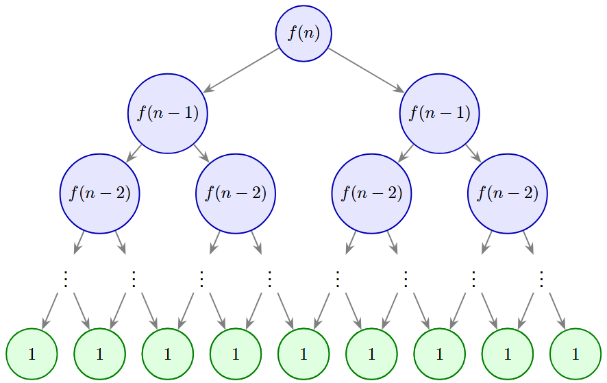

הפרק הקודם: [סימונים אסימפטוטים](https://machness42.github.io/library/cs/algorithms/analysis/Asymptotic Notations)

---

# רקורסיות ונוסחאות נסיגה

**קריאה נדרשת:** [סימונים אסימפטוטים](https://machness42.github.io/library/cs/algorithms/analysis/Asymptotic Notations), אינדוקציה.
**קריאה מומלצת:** עצים.

רקורסיה היא שם כולל לפונקציות שבמובן מסויים "חוזרות על עצמן". רקורסיות "בעלות משמעות" (כלומר שאותם תראו ובהם תשתמשו) לרוב יכילו שני מרכיבים:

1. קריאה עצמית לפונקציה *בקלט קטן יותר*.
2. תנאי עצירה.

הרעיון האינטואטיבי להבין רקורסיות הוא בעזרת *אינדוקציה*. אנו מניחים שאת מקרה הבסיס ניתן לפתור (זהו תנאי העצירה) ובהינתן פתרונות *לקלטים קטנים* יותר ניתן לפתור (בצורה כלשהי) פתרון לקלט נתון.

בפרק זה, נעסוק בגישות ושיטות לניתוח זמני ריצה של רקורסיות.

הגישה הראשונה שבה נעסוק היא "פיתוח ישיר". נפתח את הרקורסיה ונגיע לצורה מפורשת. (למעשה אנחנו נפתח מספר פעמים עד שנגיע לצורה כללית, ונוכיח אותה באינדוקציה).

**תרגיל.** סדרת פיבונאצ'י מוגדרת על ידי:

$$
f(n) =
\begin{cases}
1 & n=1 \\
2\cdot f(n-1) & n>1
\end{cases}
$$

מצאו חסם אסימפטוטי הדוק ככל הניתן על $f(n)$.

**פתרון.** נוסחת הנסיגה הינה:

$$
f(n) = 2\cdot f(n-1)
$$

אבל אפשר למצוא מהכלל מהו $f(n-1)$:

$$
f(n-1) = 2\cdot f(n-2)
$$

ולכן אפשר לקבל:

$$
f(n) = 2\cdot f(n-1) = 2\cdot(2\cdot f(n-2)) = 4 \cdot f(n-2)
$$

מצאתם את הכלל? בואו נמשיך לפתח:

$$
f(n) = 4 \cdot f(n-2) = 4\cdot (2\cdot f(n-3)) = 8\cdot f(n-3)
$$

כלומר בסה"כ אנו מקבלים:

$$
f(n) = 2^i \cdot f(n-i)
$$

לכל $i$. בואו נוכיח את זה פורמלית.

**למה.** יהי $n>1$ טבעי. אזי לכל $1\le i \le n-1$  מתקיים כי:

$$
f(n) = 2^i \cdot f(n-i)
$$

**הוכחה.** באינדוקציה על $i$. בסיס, עבור $i=1$ אנו מקבלים הלכה למעשה את נוסחת הנסיגה הנתונה מההגדרה. כעת לצעד, נניח שלכל  $1\le j <i$  מתקיים ש

$$
f(n) = 2^j\cdot f(n-j)
$$

נוכיח עבור $i$. הטענה דלעיל נכונה בפרט עבור $j=i-1$  ולכן נקבל:

$$
f(n) = 2^{i-1} \cdot f(n-i+1)
$$

כעת נציב את הביטוי $f(n-i+1)$ בנוסחת הנסיגה ונקבל ש:

$$
f(n-i+1) = 2\cdot f(n-i)
$$

ועל כן:

$$
f(n) = 2^{i-1} \cdot f(n-i+1) = 2^{i-1} \cdot 2 \cdot f(n-i) = 2^i \cdot f(n-i)
$$

ובכך הוכחנו את הלמה. משל $\blacksquare$.

כעת, משהוכחנו ש $f(n) = 2^i \cdot f(n-i)$ לכל $i$ , אפשר להציב את הקצה, כלומר $i=n-1$ ולקבל:

$$
f(n) = 2^{n-1} \cdot f(n-(n-1)) = 2^{n-1}\cdot f(1) = 2^{n-1}
$$

כמו כן, זכרו כי:

$$
f(n) = 2^{n-1} = \frac{1}{2}\cdot2^n \in \Theta\left(2^n\right)
$$

כפי שרצינו.

כמובן, לא כל המקרים יהיו ככה אבל לפעמים שיטה זו מספיקה. דרך שאמנם פחות פורמלית אך יותר אינטואיטיבית להבנה היא בעזרת עץ רקורסיה.

אם תשימו לב, ניתן לראות שכל קריאה של $f$ מתחלקת לשתי קריאות ואפשר ליצור "עץ" של הקריאות. סך כל הערכים הסופיים (תנאי העצירה) נמצאים בעלים. כיוון שזהו עץ מושלם, וגובה העץ הוא $h=n-1$ אז יש $2^h=2^{n-1}$ עלים אך ערך הפונקציה הוא סכום כל העלים, שבמקרה זה זוהי כמות העלים!

דרך נוספת היא להוכיח באינדוקציה את החסם ישירות, במקום למצוא נוסחה מפורשת וממנה לגזור חסם. הבעיה בשיטה היא שצריך לנחש את החסם, ולא בהכרח מובטח שמה שמצאנו הוא ההדוק ביותר.

